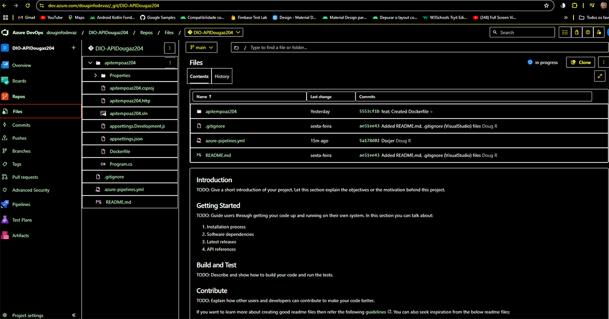
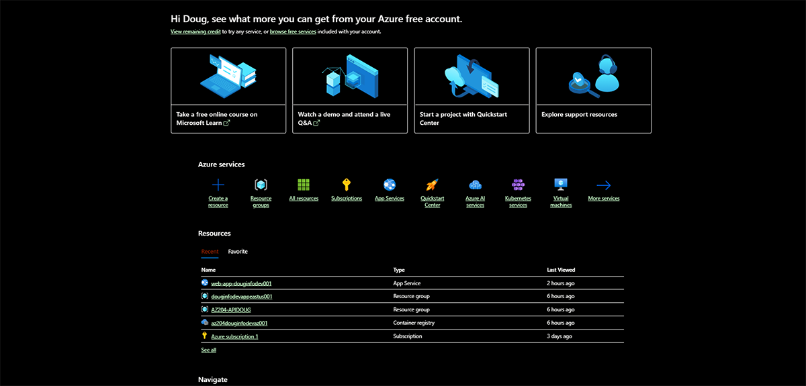

# DEPLOY / PIPELINE AZURE

## AZURE DEV TOOLS
Meu repositorio no azure dev tools do projeto

OBS: Vou apagar, pois não sei se está me gerando custos.

 <figure>
  
 <ficaption>Print do repositorio no azure dev tools</ficaption>
 </figure>

## AZURE CLOUD
Meus recursos criados na azure cloud

OBS: Vou apagar, pois estão me gerando custos.

 <figure>
  
 <ficaption>Print dos recurso na azure cloud</ficaption>
 </figure>

